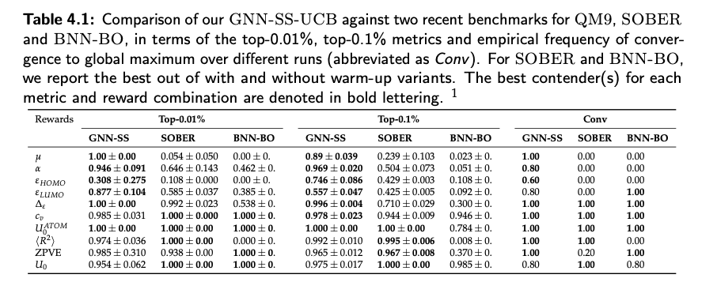

# GraphBO: A GNN Based Bayesian Optimization/Bandit Algorithm for Large Scale Molecular Discovery

This repo contains the code for my master's thesis at ETH Zurich conducted at the Learning&Adaptive Systems Lab of Prof. Andreas Krause in D-INFK. I implemented a novel GNN Based subsampling bandit algorithm to tavkle the high and complex statistical
dminesionality problem and the computational bottlenceks when scaling to combinatorially large discrete domains, namely the [QM9 dataset](https://www.nature.com/articles/sdata201422). Compatible with all built_in pytorch_geometyric datasets, 
support for general purpose graph datasets or molecular databases coming soon!

In silico screening is an essential component of drug design and materials discovery for the purpose of optimizing for various behaviours or properties of complex molecules, which hold great significance for applications in the domain of chemistry, medicine or molecular biology. This practice is challenged by the increasingly intractable size of virtual libraries hosting the candidate molecules to be screened and the high cost of evaluating the relevant molecular properties which are typically conducted through strenuous computer simulations. In this thesis, we propose GNN-BO, a Bayesian Optimization (BO) algorithm which utilizes GNNs as surrogate models, to offer a simple yet scalable solution to the task of molecular discovery. GNN-BO benefits from a random sub-sampling routine across the space of molecular candidates to reduce the overall computational complexity of the BO problem, and incidentally, diversifies the range of molecules acquired for training the model. Therefore, GNN-BO is sample-efficient and rapidly narrows down the viable search space by leveraging the generalization ability of GNNs while attaining moderately low run-times. While we reason for our algorithmic choices both qualitatively and quantitatively throughout this thesis, we further present empirical results attained by our algorithm, specifically on the well-established QM9 Dataset. We further emphasize that GNN-BO performs competitively and achieves state-of-the-art results relative to some of the most recent and popular benchmarks on this dataset. 

## Experimental Setup

(Brief discussion of hardware, minimal run code, refer to thesis section for exact hyperparams used on each experiment)

## Results

*Fig.1 Table summarizing the benchmark results of our method against two novel Bayeasian graph optimization methods: SOBER(https://arxiv.org/abs/2301.11832) and BGNN-BO(https://arxiv.org/abs/2104.11667)*

## Related Work Published In:

•	Miles Wang-Henderson, Ata Bartu Soyuer, Parnian Kassraie, Ilija Bogunovic, Andreas Krause. “Graph Neural Network Powered Bayesian Optimization for Large Molecular Spaces”. In: ICML 2023 Workshop on Structured Probabilistic Inference & Generative Modelling. (First co-author)

•	Miles Wang-Henderson, Ata Bartu Soyuer, Parnian Kassraie, Ilija Bogunovic, Andreas Krause.  “Graph Neural Bayesian Optimization for Virtual Screening”. In: NeurIPS 2023 Workshop on New Frontiers of AI for Drug Discovery & Development.

•	Miles Wang-Henderson, Ata Bartu Soyuer, Parnian Kassraie, Ilija Bogunovic, Andreas Krause.  “Graph Neural Bayesian Optimization for Virtual Screening”. In: NeurIPS 2023 Workshop on Adaptive Experimental Design and Active Learning in the Real World.
